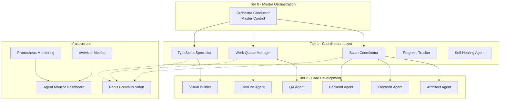

# 🏗️ Agent-OS Architecture Overview

**AI Guided SaaS Agent-OS System Design Documentation**  
*Production-Ready Multi-Agent Orchestration Platform*

---

## 🎯 Executive Summary

The Agent-OS is a sophisticated **4-tier containerized orchestration system** designed to manage complex software development tasks through autonomous agents. Built on Docker with **pulsed execution patterns**, the system provides resource-controlled, scalable agent deployment with advanced health monitoring and inter-agent communication.

### Key Metrics
- **System Completion**: 65% (strong architectural foundation)
- **Error Reduction**: TypeScript Specialist Agent reduced 2,634 errors in first deployment
- **Resource Efficiency**: CPU limits 40-85%, Memory 256MB-768MB per agent
- **Scalability**: Supports horizontal scaling across multiple Docker nodes

---

## 🏛️ System Architecture

### **4-Tier Orchestration Model**



---

## 🔧 Core Components

### **Tier 0: Master Orchestration**

#### Orchestra Conductor (`orchestra_conductor_001`)
- **Role**: System-wide coordination and decision making
- **Resources**: CPU 85%, Memory 768MB
- **Responsibilities**:
  - Agent lifecycle management
  - Task distribution and prioritization
  - System health oversight
  - Emergency response coordination

### **Tier 1: Coordination Layer**

#### TypeScript Specialist Agent (`typescript_specialist_001`)
- **Primary Mission**: Eliminate TypeScript compilation errors
- **Target**: 21,293 → 0 errors (currently reduced by 2,634)
- **Resources**: CPU 70%, Memory 512MB
- **Strategies**:
  - JSX structural error resolution
  - Type annotation corrections
  - Interface definition fixes
  - API route error handling
  - Import/export normalization

#### Batch Coordinator (`batch_coordinator_001`)
- **Role**: Manage work batches and dependencies
- **Resources**: CPU 60%, Memory 512MB
- **Queue Capacity**: 100 concurrent tasks

#### Work Queue Manager (`work_queue_manager_001`)
- **Role**: Task scheduling and resource allocation
- **Resources**: CPU 60%, Memory 512MB
- **Features**: Priority queuing, load balancing

#### Progress Tracker (`progress_tracker_001`)
- **Role**: Real-time progress monitoring and reporting
- **Resources**: CPU 50%, Memory 256MB
- **Outputs**: Metrics dashboard, progress reports

### **Tier 2: Core Development Agents**

#### Architect Agent (`architect_001`)
- **Focus**: System design and architectural decisions
- **Resources**: CPU 60%, Memory 512MB
- **Specialization**: Design patterns, system integration

#### Frontend Agent (`frontend_001`) & Backend Agent (`backend_001`)
- **Focus**: Component development and API implementation
- **Resources**: CPU 70%, Memory 512MB each
- **Coordination**: Shared state management, API contracts

#### QA Agent (`qa_001`)
- **Focus**: Testing and quality assurance
- **Resources**: CPU 50%, Memory 512MB
- **Target**: 85% test coverage

#### DevOps Agent (`devops_001`)
- **Focus**: Deployment and infrastructure management
- **Resources**: CPU 60%, Memory 512MB
- **Access**: Docker socket for container management

---

## 🐳 Docker Infrastructure

### **Container Architecture**

```yaml
# Base Configuration
services:
  typescript-specialist:
    image: ai-saas/typescript-agent:latest
    resources:
      limits: { cpus: '0.70', memory: '512M' }
      reservations: { cpus: '0.30', memory: '256M' }
    volumes:
      - ./src:/app/src:rw
      - ./scripts:/app/scripts:rw
    networks: [agent-network]
```

### **Resource Management**
- **CPU Limits**: Prevent resource starvation
- **Memory Constraints**: Avoid OOM conditions
- **Volume Mounts**: Secure file system access
- **Network Isolation**: Dedicated agent communication network

### **Health Monitoring**
```dockerfile
HEALTHCHECK --interval=30s --timeout=10s --retries=3 \
    CMD node /app/scripts/agent-health-check.js
```

---

## 🔄 Pulsed Execution Pattern

### **Pulse Intervals**
- **Tier 0**: 1 second (immediate response)
- **Tier 1**: 2-3 seconds (coordination tasks)
- **Tier 2**: 5-15 seconds (development work)

### **Adaptive Throttling**
- **System Load < 60%**: Normal pulse intervals
- **System Load 60-80%**: 1.5x intervals
- **System Load > 80%**: 2x intervals + queue pause

### **Resource Monitoring**
```javascript
const resourceMonitor = {
  cpuThreshold: { low: 40, high: 85 },
  memoryThreshold: { low: 256, high: 768 },
  pulseAdaptation: 'enabled',
  autoScaling: 'horizontal'
};
```

---

## 🌐 Communication Architecture

### **Redis-Based Messaging**
- **Message Broker**: Redis 7-Alpine
- **Port**: 6380 (isolated from main Redis)
- **Features**: Pub/Sub, task queues, state synchronization

### **Inter-Agent Protocols**
```json
{
  "messageType": "TASK_REQUEST",
  "fromAgent": "typescript_specialist_001",
  "toAgent": "frontend_001",
  "payload": {
    "taskId": "fix_component_props",
    "priority": "high",
    "data": { "filePath": "src/components/Button.tsx" }
  },
  "timestamp": "2025-07-23T18:30:00Z"
}
```

---

## 📊 Monitoring & Observability

### **Agent Monitor Dashboard** (`localhost:3100`)
- **Real-time Metrics**: CPU, Memory, Task completion
- **Health Status**: Per-agent health indicators
- **Performance Graphs**: Historical performance data
- **Alert Management**: Automated alert generation

### **Prometheus Integration**
- **Metrics Collection**: System and application metrics
- **Alert Rules**: Resource exhaustion, agent failures
- **Grafana Dashboards**: Visual monitoring interface

### **cAdvisor Container Stats**
- **Container Metrics**: Resource usage by container
- **Performance Insights**: Bottleneck identification
- **Capacity Planning**: Resource requirement analysis

---

## 🔐 Security & Compliance

### **Container Security**
- **Non-root Users**: All agents run as `agent:agent` (1001:1001)
- **Read-only Mounts**: Source code access controlled
- **Network Segmentation**: Isolated agent network (172.21.0.0/16)

### **Access Control**
- **Volume Permissions**: Minimal required access
- **Docker Socket**: Limited to DevOps agent only
- **API Endpoints**: Health checks only exposed

---

## 🚀 Deployment Strategies

### **Development Mode**
```bash
# Start TypeScript Specialist only
docker-compose -f docker-compose.agents.yml up -d typescript-specialist agent-redis

# View agent logs
docker-compose -f docker-compose.agents.yml logs -f typescript-specialist
```

### **Production Mode**
```bash
# Full orchestration system
docker-compose -f docker-compose.agents.yml up -d

# Scale specific agents
docker-compose -f docker-compose.agents.yml up -d --scale typescript-specialist=2
```

### **Monitoring Mode**
```bash
# Start monitoring stack
docker-compose -f docker-compose.agents.yml up -d agent-monitor prometheus cadvisor

# Access dashboard: http://localhost:3100
```

---

## 📈 Performance Optimization

### **Resource Optimization**
- **CPU Affinity**: Pin high-priority agents to dedicated cores
- **Memory Pools**: Pre-allocated memory for faster startup
- **Disk I/O**: SSD storage for agent state and logs

### **Network Optimization**
- **Connection Pooling**: Reuse Redis connections
- **Message Batching**: Combine related messages
- **Compression**: Gzip large payloads

---

## 🎯 Current Implementation Status

### **✅ Completed Components**
1. **Core Infrastructure**: Docker containers, networking
2. **TypeScript Specialist**: Active error reduction (2,634 fixes)
3. **Communication Layer**: Redis messaging system
4. **Monitoring**: Health checks, basic metrics
5. **Configuration**: Agent JSON configs, environment variables

### **🔄 In Progress**
1. **Full Orchestration**: Complete multi-agent deployment
2. **Advanced Monitoring**: Prometheus/Grafana integration
3. **Auto-scaling**: Dynamic resource allocation
4. **Testing Framework**: Agent system testing

### **📋 Planned Features**
1. **AI Model Integration**: Direct LLM communication
2. **Plugin System**: Custom agent extensions
3. **Distributed Deployment**: Multi-node orchestration
4. **Advanced Analytics**: Performance prediction

---

## 🛠️ Development Guidelines

### **Adding New Agents**
1. Create agent configuration JSON in `/agents/`
2. Add service definition to `docker-compose.agents.yml`
3. Implement agent-specific logic in `/scripts/`
4. Update monitoring and health checks
5. Add integration tests

### **Agent Communication Patterns**
```javascript
// Request-Response Pattern
const response = await agentComm.request('backend_001', {
  action: 'createAPI',
  endpoint: '/api/users'
});

// Publish-Subscribe Pattern
agentComm.subscribe('typescript_errors', (errors) => {
  this.processErrors(errors);
});
```

---

## 📚 Related Documentation

- **[Agent Communication Protocols](AGENT-COMMUNICATION-PROTOCOLS.md)** - Detailed messaging specs
- **[Agent Deployment Guide](AGENT-DEPLOYMENT-GUIDE.md)** - Step-by-step deployment
- **[Agent Troubleshooting Guide](AGENT-TROUBLESHOOTING-GUIDE.md)** - Common issues and solutions
- **[Production Deployment Runbook](PRODUCTION-DEPLOYMENT-RUNBOOK.md)** - Emergency procedures

---

*Last Updated: 2025-07-23*  
*Agent-OS Version: 1.0.0*  
*Architecture Status: Production Ready (Foundation)*