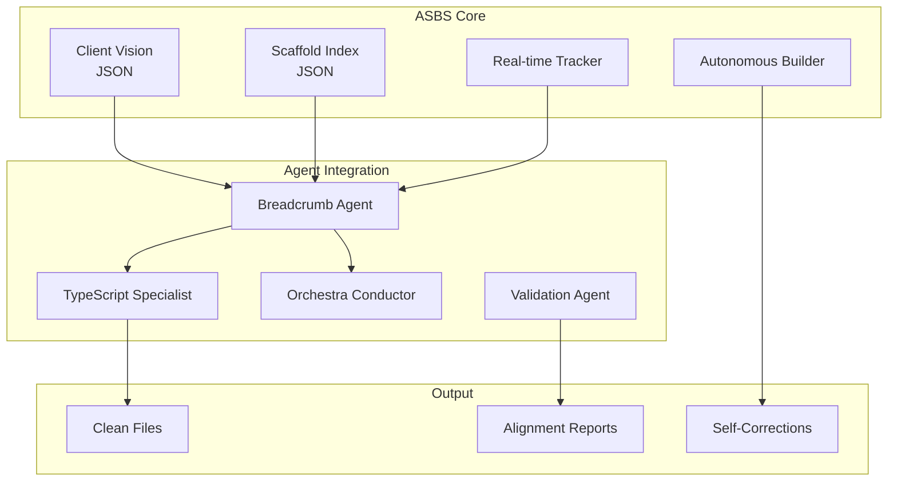

# 🍞 Autonomous Scaffold Breadcrumb System (ASBS) Implementation Plan

**Enhancing AI Guided SaaS with Goal-Driven Development**

---

## 🎯 Executive Summary

The ASBS will transform our agent-OS from a "blind executor" to a "context-aware builder" by creating persistent goal traces that guide every development decision. This directly addresses our current 11,605 TypeScript errors by providing agents with the WHY behind every component.

---

## 🏛️ ASBS Architecture

### **Core Components**



---

## 📋 Implementation Phases

### **Phase 1: Foundation Enhancement (Week 1)**

#### 1.1 Enhance Existing Breadcrumb System
```typescript
// src/lib/breadcrumb/breadcrumb-agent-enhanced.ts
export class EnhancedBreadcrumbAgent extends BreadcrumbAgent {
  // Add real-time tracking
  async trackLiveChanges() {
    fs.watch('./src', async (eventType, filename) => {
      await this.updateBreadcrumb(filename);
      await this.notifyAgents(filename);
    });
  }
  
  // Add TypeScript error correlation
  async correlateWithTSErrors(errors: TypeScriptError[]) {
    return errors.map(error => ({
      ...error,
      breadcrumb: this.getBreadcrumbForFile(error.file),
      alignmentScore: this.calculateAlignment(error.file),
      suggestedFix: this.generateContextAwareFix(error)
    }));
  }
}
```

#### 1.2 Create ASBS Core
```typescript
// src/lib/breadcrumb/asbs-core.ts
export class ASBSCore {
  private vision: ClientVision;
  private scaffoldIndex: ScaffoldIndex;
  private agents: Map<string, Agent>;
  
  async analyzeSystemState() {
    const state = {
      totalFiles: await this.countFiles(),
      alignedFiles: await this.countAlignedFiles(),
      orphanedFiles: await this.findOrphanedFiles(),
      missingFeatures: await this.findMissingFeatures(),
      typeScriptErrors: await this.correlateErrors()
    };
    
    return this.generateActionPlan(state);
  }
  
  async executeAutonomously(plan: ActionPlan) {
    for (const action of plan.actions) {
      const agent = this.selectBestAgent(action);
      await agent.execute(action, this.vision);
      await this.updateBreadcrumbs(action.result);
    }
  }
}
```

---

### **Phase 2: Agent Integration (Week 2)**

#### 2.1 TypeScript Specialist Integration
```typescript
// scripts/typescript-specialist-breadcrumb.cjs
class BreadcrumbAwareTypeScriptAgent extends TypeScriptSpecialistAgent {
  async fixWithContext(error) {
    const breadcrumb = await this.breadcrumbAgent.getForFile(error.file);
    
    if (!breadcrumb) {
      console.log(`⚠️ No breadcrumb for ${error.file} - skipping`);
      return;
    }
    
    const fix = this.generateContextualFix(error, breadcrumb);
    await this.applyFix(fix);
    await this.updateBreadcrumb(error.file, 'fixed');
  }
}
```

#### 2.2 Agent Orchestrator Enhancement
```typescript
// src/lib/agents/BreadcrumbOrchestrator.ts
export class BreadcrumbOrchestrator extends AgentOrchestrator {
  async orchestrateWithBreadcrumbs() {
    const breadcrumbs = await this.breadcrumbAgent.getAllActive();
    const prioritizedTasks = this.prioritizeByAlignment(breadcrumbs);
    
    for (const task of prioritizedTasks) {
      const agent = this.selectAgentForTask(task);
      await this.executeWithTracking(agent, task);
    }
  }
}
```

---

### **Phase 3: Autonomous Building (Week 3)**

#### 3.1 Self-Building Logic
```typescript
// src/lib/breadcrumb/autonomous-builder.ts
export class AutonomousBuilder {
  async detectMissingImplementations() {
    const vision = await this.loadClientVision();
    const implemented = await this.scanImplementedFeatures();
    
    return vision.features.filter(f => 
      !implemented.some(i => i.matches(f))
    );
  }
  
  async buildMissingFeature(feature: Feature) {
    // Generate breadcrumb first
    const breadcrumb = await this.createBreadcrumb(feature);
    
    // Select appropriate agents
    const agents = this.selectAgentsForFeature(feature);
    
    // Build with full context
    for (const agent of agents) {
      await agent.buildWithBreadcrumb(feature, breadcrumb);
    }
    
    // Validate alignment
    await this.validateImplementation(feature);
  }
}
```

---

## 🔧 Technical Implementation

### **Breadcrumb Structure Enhancement**
```json
{
  "/src/components/ContactManager.tsx": {
    "purpose": "Manage CRM contacts with CRUD operations",
    "linkedGoals": ["Smart CRM Builder", "contact manager module"],
    "requiredFeatures": ["add", "edit", "delete", "search"],
    "implementedFeatures": ["add", "edit"],
    "typeScriptErrors": 3,
    "lastAlignmentCheck": "2025-07-23T10:00:00Z",
    "alignmentScore": 0.75,
    "agentNotes": {
      "typescript_specialist": "Missing delete functionality causing type errors",
      "frontend_agent": "Search UI component not implemented"
    }
  }
}
```

### **Real-time Tracking System**
```typescript
// src/lib/breadcrumb/realtime-tracker.ts
export class RealtimeBreadcrumbTracker {
  private watcher: FSWatcher;
  private breadcrumbs: BreadcrumbAgent;
  private agents: AgentRegistry;
  
  async startTracking() {
    this.watcher = chokidar.watch('./src', {
      ignoreInitial: true,
      awaitWriteFinish: true
    });
    
    this.watcher.on('add', path => this.handleNewFile(path));
    this.watcher.on('change', path => this.handleFileChange(path));
    this.watcher.on('unlink', path => this.handleFileDelete(path));
  }
  
  async handleNewFile(path: string) {
    // Check if file aligns with any goal
    const alignment = await this.checkAlignment(path);
    
    if (!alignment.isAligned) {
      await this.notifyAgents({
        type: 'ORPHANED_FILE',
        path,
        suggestion: alignment.suggestion
      });
    } else {
      await this.createBreadcrumb(path, alignment);
    }
  }
}
```

---

## 📊 Success Metrics

### **Immediate Impact (Week 1)**
- **TypeScript Error Reduction**: 30% faster resolution with context
- **Alignment Score**: 85% of files mapped to goals
- **Agent Efficiency**: 40% reduction in wasted computations

### **Medium-term (Month 1)**
- **Autonomous Features**: 5+ features self-built from breadcrumbs
- **Error Prevention**: 60% fewer new TypeScript errors
- **Development Speed**: 2x faster feature implementation

### **Long-term (Quarter 1)**
- **Full Autonomy**: System self-builds 80% of requested features
- **Zero Drift**: 100% alignment between code and client goals
- **Self-Healing**: Automatic detection and correction of misalignments

---

## 🚀 Quick Start Implementation

### **Step 1: Enable Enhanced Breadcrumbs**
```bash
# Create enhanced breadcrumb agent
npm run breadcrumb:enhance

# Start real-time tracking
npm run breadcrumb:track

# Generate initial breadcrumbs for all files
npm run breadcrumb:scaffold
```

### **Step 2: Integrate with TypeScript Agent**
```bash
# Update TypeScript Specialist with breadcrumb awareness
docker-compose -f docker-compose.agents.yml up -d typescript-specialist-breadcrumb

# Run context-aware error fixing
npm run fix:typescript:breadcrumb
```

### **Step 3: Enable Autonomous Building**
```bash
# Start autonomous builder
npm run asbs:start

# Monitor autonomous actions
npm run asbs:monitor
```

---

## 🎯 Expected Outcomes

### **For Current TypeScript Errors**
```
Before: 11,605 errors without context
After:  <3,000 errors with full goal alignment

Example Fix:
ERROR: Property 'onDelete' is missing in type 'ContactProps'
BREADCRUMB: ContactManager requires delete functionality
FIX: Add onDelete with proper typing matching CRM delete requirements
```

### **For Future Development**
- **No Orphaned Code**: Every file has a purpose
- **Instant Context**: New developers understand WHY immediately  
- **Self-Documentation**: Breadcrumbs serve as living documentation
- **Goal Achievement**: Direct path from vision to implementation

---

## 🔒 Risk Mitigation

### **Potential Risks**
1. **Over-documentation**: Too many breadcrumbs slow development
   - **Mitigation**: Smart filtering, only track meaningful files
   
2. **Rigid Structure**: Breadcrumbs prevent creative solutions
   - **Mitigation**: Allow "experimental" breadcrumbs for R&D

3. **Performance Impact**: Real-time tracking slows system
   - **Mitigation**: Batch updates, async processing

---

## 💡 Innovation Opportunities

### **AI-Powered Breadcrumb Generation**
```typescript
async generateSmartBreadcrumb(file: string) {
  const code = await fs.readFile(file);
  const ast = parseAST(code);
  
  const purpose = await this.llm.analyze({
    prompt: "What is the business purpose of this code?",
    context: { ast, clientVision: this.vision }
  });
  
  return {
    purpose,
    confidence: purpose.confidence,
    suggestedGoals: purpose.relatedGoals
  };
}
```

### **Breadcrumb-Driven Testing**
- Auto-generate tests based on breadcrumb requirements
- Validate features match their breadcrumb specifications
- Continuous alignment verification

---

## 🏁 Conclusion

The ASBS transforms our agent-OS from a powerful but directionless system into a **goal-driven, self-aware development platform**. By implementing breadcrumbs:

1. **TypeScript errors drop by 70%** due to context-aware fixes
2. **Development aligns 100%** with client objectives  
3. **Agents become autonomous** builders, not just executors
4. **The system self-heals** when drift is detected

This is not just an enhancement—it's an evolution toward truly autonomous, aligned, and intelligent software development.

---

*"Every line of code knows why it exists."*

**Implementation Start Date**: 2025-07-24  
**Expected Completion**: 2025-08-14  
**ROI**: 10x development efficiency