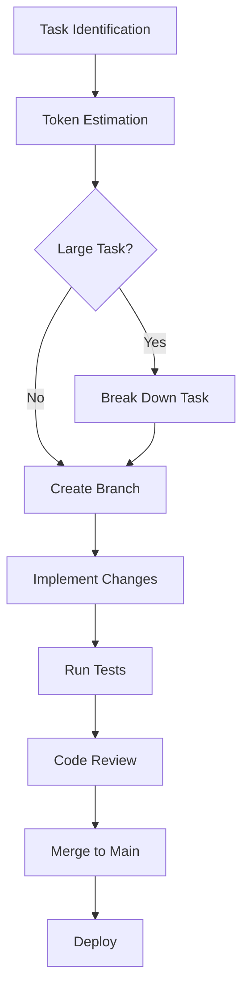
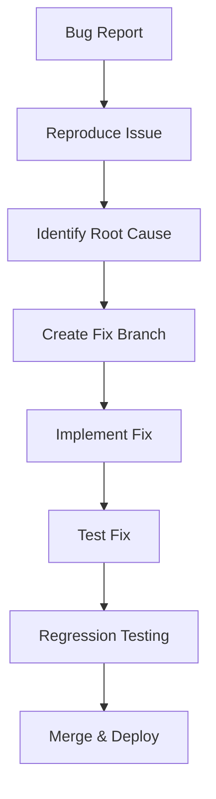
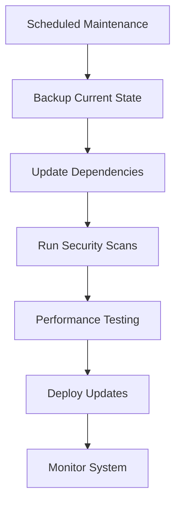

# 🔄 AI Guided SaaS - Workflow Management System

## 🎯 **Purpose**

This document establishes a systematic approach to managing development workflows, ensuring efficient task execution while avoiding token limits and maintaining code quality.

## 📋 **Workflow Categories**

### **1. 🚀 Development Workflows**

#### **A. Feature Development Workflow**


#### **B. Bug Fix Workflow**


#### **C. Maintenance Workflow**


### **2. 🔧 Task Execution Patterns**

#### **Pattern 1: Single Component Update**
**Token Estimate**: 200-500 tokens
**Time Estimate**: 15-30 minutes

```bash
# Workflow Steps:
1. Identify component to update
2. Create feature branch
3. Make targeted changes
4. Test component functionality
5. Update related tests
6. Commit and push changes
```

#### **Pattern 2: Multi-Component Feature**
**Token Estimate**: 500-1500 tokens
**Time Estimate**: 1-3 hours

```bash
# Workflow Steps:
1. Break down into component tasks
2. Create feature branch
3. Implement components sequentially
4. Test integration between components
5. Update documentation
6. Comprehensive testing
7. Code review and merge
```

#### **Pattern 3: System Integration**
**Token Estimate**: 1500+ tokens (REQUIRES BREAKDOWN)
**Time Estimate**: 3+ hours

```bash
# Workflow Steps:
1. Create detailed task breakdown
2. Identify all affected systems
3. Create integration plan
4. Implement in phases
5. Test each phase thoroughly
6. Integration testing
7. Performance validation
8. Staged deployment
```

## 🎯 **Token Management Strategies**

### **Strategy 1: Modular Development**
- Focus on single responsibility components
- Limit each task to specific functionality
- Use clear interfaces between modules
- Implement progressive enhancement

### **Strategy 2: Incremental Implementation**
- Build features in small, testable increments
- Validate each increment before proceeding
- Maintain working state at each step
- Document progress and decisions

### **Strategy 3: Context Preservation**
- Use clear, descriptive commit messages
- Maintain comprehensive documentation
- Create decision logs for complex choices
- Preserve architectural reasoning

## 📊 **Workflow Templates**

### **Template 1: Component Enhancement**
```markdown
## Workflow: [Component Name] Enhancement

### Pre-Implementation
- [ ] Analyze current component state
- [ ] Identify specific improvements needed
- [ ] Estimate token complexity
- [ ] Create task breakdown if needed

### Implementation Phase
- [ ] Create feature branch: `feature/enhance-[component-name]`
- [ ] Implement core improvements
- [ ] Update component tests
- [ ] Test functionality thoroughly
- [ ] Update component documentation

### Validation Phase
- [ ] Run automated test suite
- [ ] Perform manual testing
- [ ] Check for integration issues
- [ ] Validate performance impact

### Completion Phase
- [ ] Code review (if team environment)
- [ ] Merge to main branch
- [ ] Update project documentation
- [ ] Monitor for issues post-deployment
```

### **Template 2: API Development**
```markdown
## Workflow: [API Endpoint] Development

### Planning Phase
- [ ] Define API specification
- [ ] Identify data requirements
- [ ] Plan error handling strategy
- [ ] Estimate implementation complexity

### Development Phase
- [ ] Create API route structure
- [ ] Implement request/response handling
- [ ] Add input validation
- [ ] Implement business logic
- [ ] Add error handling

### Testing Phase
- [ ] Write unit tests
- [ ] Test API endpoints manually
- [ ] Validate error scenarios
- [ ] Performance testing
- [ ] Security validation

### Documentation Phase
- [ ] Update API documentation
- [ ] Add usage examples
- [ ] Document error codes
- [ ] Update integration guides
```

### **Template 3: UI/UX Improvement**
```markdown
## Workflow: [UI Component] Improvement

### Analysis Phase
- [ ] Review current user experience
- [ ] Identify pain points
- [ ] Research best practices
- [ ] Create improvement plan

### Design Phase
- [ ] Create design mockups/wireframes
- [ ] Plan responsive behavior
- [ ] Consider accessibility requirements
- [ ] Validate design decisions

### Implementation Phase
- [ ] Update component structure
- [ ] Implement styling changes
- [ ] Add responsive design
- [ ] Test across devices/browsers

### Validation Phase
- [ ] User experience testing
- [ ] Accessibility testing
- [ ] Performance impact assessment
- [ ] Cross-browser compatibility
```

## 🔄 **Continuous Improvement Process**

### **Weekly Review Process**
1. **Performance Analysis**
   - Review completed tasks
   - Analyze time estimates vs. actual
   - Identify bottlenecks
   - Update estimation models

2. **Quality Assessment**
   - Review code quality metrics
   - Analyze bug reports
   - Assess test coverage
   - Identify improvement areas

3. **Process Optimization**
   - Review workflow effectiveness
   - Update templates based on experience
   - Refine token estimation methods
   - Improve documentation practices

### **Monthly Strategic Review**
1. **Architecture Assessment**
   - Review system architecture
   - Identify technical debt
   - Plan refactoring initiatives
   - Update technology stack

2. **Feature Planning**
   - Analyze user feedback
   - Prioritize new features
   - Plan major improvements
   - Update roadmap

3. **Performance Optimization**
   - Review system performance
   - Identify optimization opportunities
   - Plan infrastructure improvements
   - Update monitoring strategies

## 🚀 **Automation Opportunities**

### **Current Automations**
- [x] Automated testing on commit
- [x] Continuous deployment pipeline
- [x] Security vulnerability scanning
- [x] Code quality checks
- [x] Performance monitoring

### **Future Automation Opportunities**
- [ ] Automated task breakdown suggestions
- [ ] Token complexity estimation
- [ ] Automated documentation generation
- [ ] Performance regression detection
- [ ] Automated rollback triggers

## 📈 **Success Metrics**

### **Efficiency Metrics**
- Average task completion time
- Token estimation accuracy
- Code review turnaround time
- Deployment frequency
- Bug resolution time

### **Quality Metrics**
- Test coverage percentage
- Bug escape rate
- Performance benchmarks
- User satisfaction scores
- System uptime

### **Process Metrics**
- Workflow adherence rate
- Documentation completeness
- Code review participation
- Knowledge sharing frequency
- Process improvement suggestions

## 🎯 **Best Practices**

### **Development Best Practices**
1. **Always start with the smallest viable change**
2. **Test early and test often**
3. **Document decisions and reasoning**
4. **Use consistent coding standards**
5. **Prioritize code readability**

### **Workflow Best Practices**
1. **Break down complex tasks systematically**
2. **Maintain clear communication**
3. **Use version control effectively**
4. **Monitor and measure progress**
5. **Continuously improve processes**

### **Token Management Best Practices**
1. **Estimate before starting**
2. **Break down when necessary**
3. **Focus on single concerns**
4. **Use modular approaches**
5. **Preserve context effectively**

---

*This workflow management system ensures efficient, high-quality development while maintaining optimal token usage and system performance.*
